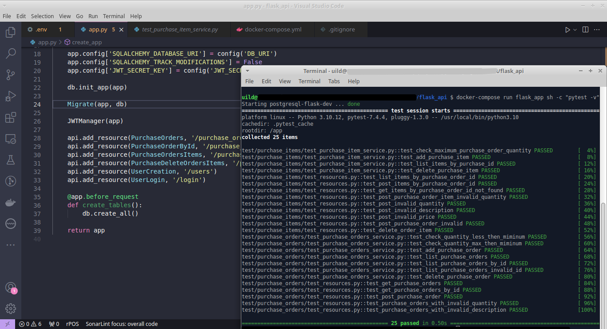

#Multilingual Content (Portuguese, English)

Instruções de Configuração: Projeto Flask com Docker

Este projeto usa Docker para facilitar a configuração e execução do aplicativo Flask. Antes de começar, certifique-se de ter o Docker Desktop instalado. Você pode baixá-lo [aqui](https://www.docker.com/products/docker-desktop/).
Você também precisará do Python3.10 ou superior
Observação: Os testes desse projeto foram criados utilizando Pytest.
Configuração Inicial

Clone o Repositório:

    git clone https://seurepositorio.git
    cd seu-repositorio

Inicie os Serviços Docker:

    docker-compose up -d --build

Execução dos Testes
    Todos os Testes:
    
    docker-compose run app sh -c "pytest -v -s"

Testes Específicos:
Para executar testes específicos, forneça os nomes dos testes como argumentos. Por exemplo, para executar todos os testes que começam com "test_list_purchase":

    docker-compose run app sh -c "pytest -v -s -k test_list_purchase"

Subir o Aplicativo:

    docker-compose run app

Observações:
    Certifique-se de que o Docker Desktop está em execução antes de iniciar os serviços Docker.
    Certifique-se de que as permissões necessárias estejam concedidas para execução dos comandos Docker.

Pronto! Seu ambiente Flask com Docker está configurado e pronto para ser utilizado. Para mais informações sobre o projeto e suas funcionalidades, consulte a documentação ou o código-fonte do aplicativo.

English

Instructions for Setting Up: Flask Project with Docker

This project utilizes Docker to streamline the configuration and execution of the Flask application. Before getting started, ensure you have Docker Desktop installed. You can download it here.
You will also need Python 3.10 or later.
Note: The tests in this project were created using Pytest.

Initial Setup

  Clone the Repository:

    git clone https://yourrepository.git
    cd your-repository

Start Docker Services:

    docker-compose up -d --build

Running Tests

  All Tests:

    docker-compose run app sh -c "pytest -v -s"

Specific Tests:
To run specific tests, provide the test names as arguments. For example, to run tests starting with "test_list_purchase":

bash

    docker-compose run app sh -c "pytest -v -s -k test_list_purchase"

Run the Application:

    docker-compose run app

Notes

  Ensure Docker Desktop is running before starting Docker services.
  Make sure the necessary permissions are granted for executing Docker commands.

Your Flask environment with Docker is now configured and ready to use. For more information about the project and its functionalities, refer to the documentation or the application's source code.

